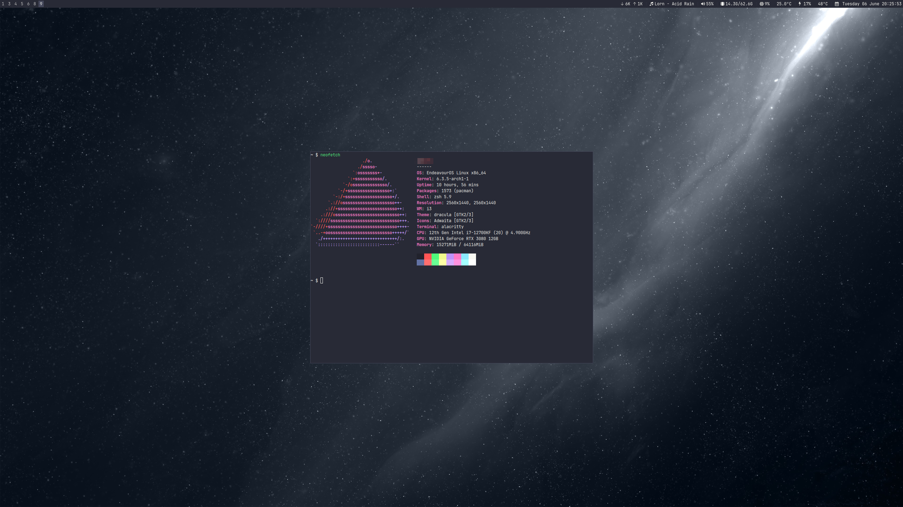

# About
My dotfiles. Configuration for my linux environment.



# Dependencies
```bash
yay -S stow git ueberzug i3 i3blocks
```

# Stow
Clone directory into `~/.dotfiles`

```bash
stow *
```

Or for an individual application you can stow a single directory (i3 for example):

```bash
stow i3
```

